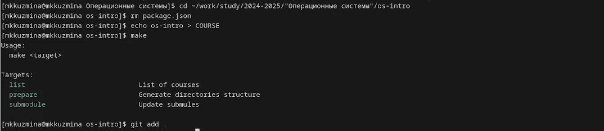

---
## Front matter
title: "Отчёт по лабораторной работе №2"
subtitle: "Дисциплина: Операционные системы"
author: "Кузьмина Мария Константиновна"

## Generic otions
lang: ru-RU
toc-title: "Содержание"

## Bibliography
bibliography: bib/cite.bib

## Pdf output format
toc: true # Table of contents
toc-depth: 2
lof: true # List of figures
fontsize: 12pt
linestretch: 1.5
papersize: a4
documentclass: scrreprt
## I18n polyglossia
polyglossia-lang:
  name: russian
  options:
	- spelling=modern
	- babelshorthands=true
polyglossia-otherlangs:
  name: english
## I18n babel
babel-lang: russian
babel-otherlangs: english
## Fonts
mainfont: IBM Plex Serif
romanfont: IBM Plex Serif
sansfont: IBM Plex Sans
monofont: IBM Plex Mono
mathfont: STIX Two Math
mainfontoptions: Ligatures=Common,Ligatures=TeX,Scale=0.94
romanfontoptions: Ligatures=Common,Ligatures=TeX,Scale=0.94
sansfontoptions: Ligatures=Common,Ligatures=TeX,Scale=MatchLowercase,Scale=0.94
monofontoptions: Scale=MatchLowercase,Scale=0.94,FakeStretch=0.9
mathfontoptions:
## Biblatex
biblatex: true
biblio-style: "gost-numeric"
biblatexoptions:
  - parentracker=true
  - backend=biber
  - hyperref=auto
  - language=auto
  - autolang=other*
  - citestyle=gost-numeric
## Pandoc-crossref LaTeX customization
figureTitle: "Рис."
listingTitle: "Листинг"
lofTitle: "Список иллюстраций"
lolTitle: "Листинги"
## Misc options
indent: true
header-includes:
  - \usepackage{indentfirst}
  - \usepackage{float} # keep figures where there are in the text
  - \floatplacement{figure}{H} # keep figures where there are in the text
---

# Цель работы

Изучить идеологию и применение средств контроля версий. Освоить умения по работе с git.

# Задание

1. Создать базовую конфигурацию для работы с git.
2. Создать ключ SSH.
3. Создать ключ PGP.
4. Создать локальный каталог для выполнения заданий по предмету.
5. Настроить каталог курса

# Выполнение лабораторной работы

## Создать базовую конфигурацию для работы с git.
Устанавливаем git, gh, задаем имя и email владельца репозитория, настраиваем utf-8 в выводе сообщений git, задаем имя начальной ветки,:(рис. [-@fig:001]):

{#fig:001 width=100%}

## Создать ключ SSH.

Создаем ssh ключ (рис. [-@fig:002]):

{#fig:002 width=100%}

## Создать ключь PGP

Создаем ключ и выбираем из предложенных опций тип, размер, срок действия (рис. [-@fig:003]):

{#fig:003 width=100%}

Выводим список ключей и копируем отпечаток приватного ключа, копируем наш сгенерированный PGP ключ в буфер обмена, переходим на гитхаб и вставляем скопированный ключ, используя введёный email, указываем Git применять его при подписи коммитов (рис. [-@fig:004]):

{#fig:004 width=100%}

## Создать локальный каталог для выполнения заданий по предмету.

создаём директорию для работы, переходим в созданную директорию, создаём репозиторий на GitHub с указанным шаблоном и делает его публичным, клонируем созданный репозиторий в локальную папку os- с загрузкой всех подмодулей (--recursive).(рис. [-@fig:005]):

{#fig:005 width=100%}

## Настроить каталог курса

Переходи в каталог, удаляем лишние файлы, создаем необходимые каталоги (рис. [-@fig:006]):

{#fig:006 width=100%}

отправляем на сервер (рис. [-@fig:007]):

{#fig:007 width=100%}

