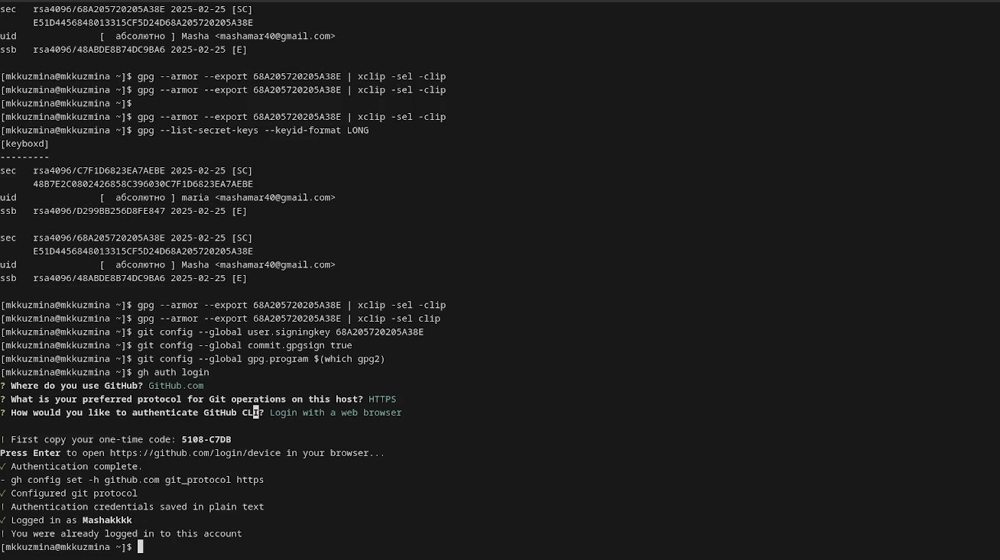
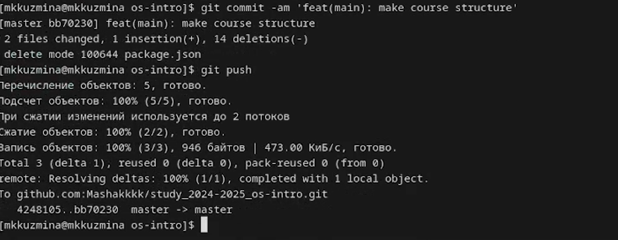

---
## Front matter
lang: ru-RU
title: Лабораторная работа №5
subtitle: Операционные системы
author:
  - Кузьмина М. К.
institute:
  - Российский университет дружбы народов, Москва, Россия
date: 2025

## i18n babel
babel-lang: russian
babel-otherlangs: english

## Formatting pdf
toc: false
toc-title: Содержание
slide_level: 2
aspectratio: 169
section-titles: true
theme: metropolis
header-includes:
 - \metroset{progressbar=frametitle,sectionpage=progressbar,numbering=fraction}
 - '\makeatletter'
 - '\beamer@ignorenonframefalse'
 - '\makeatother'
---

# Цель работы

Изучить средства управления паролями и конфигурациями, освоить работу с chezmoi.

# Задание

1. Установка менеджера паролей
2. Настройка синхронизации с git
3. Установка плагина для браузера
4. Добавление пароля в хранилище
5. Установка дополнительного ПО 
6. Установка и настройка chezmoi

# Выполнение лабораторной работы

## Установка менеджера паролей
Устанавливаем pass и gopass и смотрим список ключей (рис. [-@fig:001]):

{#fig:001 width=30%}

Инициализируем хранилище паролей (рис. [-@fig:002]):

{#fig:002 width=30%}

## Настройка синхронизации с git

Создаем структуру git и добавляем репозиторий (рис. [-@fig:003]):

{#fig:003 width=30%}

{#fig:004 width=30%}

{#fig:005 width=30%}

## Установка плагина для браузера

Устанавливаем плагин для browserpass браузера, устанавливаем интерфейс для взаимодействия с браузером (рис. [-@fig:006]):

{#fig:006 width=70%}

## Добавление пароля в хранилище

Добавляем новый пароль, (показываем его) и меняем. (рис. [-@fig:007]):

{#fig:007 width=50%}

{#fig:008 width=50%}

## Установка дополнительного ПО 

Устанавливаем необходимые пакеты (рис. [-@fig:009]) и шрифты (рис. [-@fig:010]):

{#fig:009 width=45%}

{#fig:010 width=45%}

## Установка и настройка chezmoi

Устанавливаем chezmoi с помощью команды sh -c "$(wget -qO- chezmoi.io/get)", создаем собственный репозиторий с помощью gh repo create dotfiles --template="yamadharma/dotfiles-template" --private, инициализируем chezmoi (рис. [-@fig:012]):

{#fig:012 width=100%}

## Выводы

При выполнении данной лабораторной работы были изучены средства управления паролями и конфигурациями и освоена работу с chezmoi.

