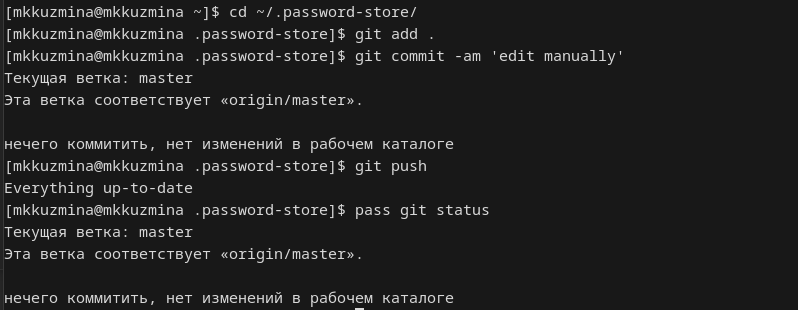

---
## Front matter
title: "Отчёт по лабораторной работе №5"
subtitle: "Дисциплина: Операционные системы"
author: "Кузьмина Мария Константиновна"

## Generic otions
lang: ru-RU
toc-title: "Содержание"

## Bibliography
bibliography: bib/cite.bib

## Pdf output format
toc: true # Table of contents
toc-depth: 2
lof: true # List of figures
fontsize: 12pt
linestretch: 1.5
papersize: a4
documentclass: scrreprt
## I18n polyglossia
polyglossia-lang:
  name: russian
  options:
	- spelling=modern
	- babelshorthands=true
polyglossia-otherlangs:
  name: english
## I18n babel
babel-lang: russian
babel-otherlangs: english
## Fonts
mainfont: IBM Plex Serif
romanfont: IBM Plex Serif
sansfont: IBM Plex Sans
monofont: IBM Plex Mono
mathfont: STIX Two Math
mainfontoptions: Ligatures=Common,Ligatures=TeX,Scale=0.94
romanfontoptions: Ligatures=Common,Ligatures=TeX,Scale=0.94
sansfontoptions: Ligatures=Common,Ligatures=TeX,Scale=MatchLowercase,Scale=0.94
monofontoptions: Scale=MatchLowercase,Scale=0.94,FakeStretch=0.9
mathfontoptions:
## Biblatex
biblatex: true
biblio-style: "gost-numeric"
biblatexoptions:
  - parentracker=true
  - backend=biber
  - hyperref=auto
  - language=auto
  - autolang=other*
  - citestyle=gost-numeric
## Pandoc-crossref LaTeX customization
figureTitle: "Рис."
listingTitle: "Листинг"
lofTitle: "Список иллюстраций"
lolTitle: "Листинги"
## Misc options
indent: true
header-includes:
  - \usepackage{indentfirst}
  - \usepackage{float} # keep figures where there are in the text
  - \floatplacement{figure}{H} # keep figures where there are in the text
---

# Цель работы

Изучить средства управления паролями и конфигурациями, освоить работу с git и chezmoi.

# Задание

1. Установка менеджера паролей
2. Настройка синхронизации с git
3. Установка плагина для браузера
4. Добавление пароля в хранилище
5. Установка дополнительного ПО 
6. Установка и настройка chezmoi

# Выполнение лабораторной работы

## Установка менеджера паролей
Устанавливаем pass и gopass и смотрим список ключей (рис. [-@fig:001]):

{#fig:001 width=100%}

Инициализируем хранилище паролей (рис. [-@fig:002]):

{#fig:002 width=100%}

## Настройка синхронизации с git

Создаем структуру git и добавляем репозиторий (рис. [-@fig:003]):

{#fig:003 width=100%}

{#fig:004 width=100%}

{#fig:005 width=100%}

## Установка плагина для браузера

Устанавливаем плагин для browserpass браузера, устанавливаем интерфейс для взаимодействия с браузером (рис. [-@fig:006]):

{#fig:006 width=100%}

## Добавление пароля в хранилище

Добавляем новый пароль, (показываем его) и меняем. (рис. [-@fig:007]):

{#fig:007 width=100%}

{#fig:008 width=100%}

## Установка дополнительного ПО 

Устанавливаем необходимые пакеты (рис. [-@fig:009]) и шрифты (рис. [-@fig:010]):

{#fig:009 width=100%}

{#fig:010 width=100%}

## Установка и настройка chezmoi

Устанавливаем chezmoi с помощью команды sh -c "$(wget -qO- chezmoi.io/get)", создаем собственный репозиторий с помощью gh repo create dotfiles --template="yamadharma/dotfiles-template" --private, инициализируем chezmoi (рис. [-@fig:012]):

{#fig:012 width=100%}

