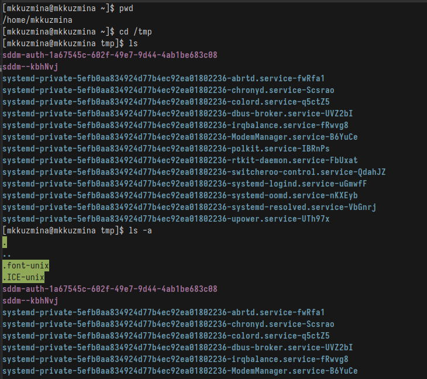
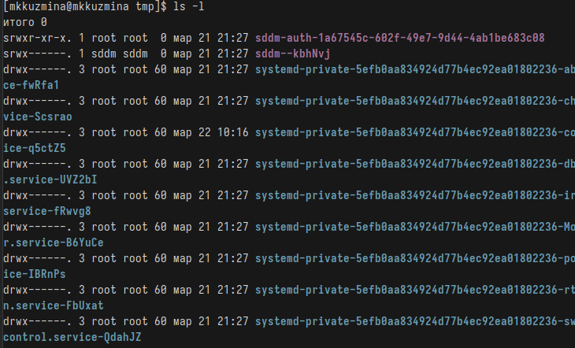
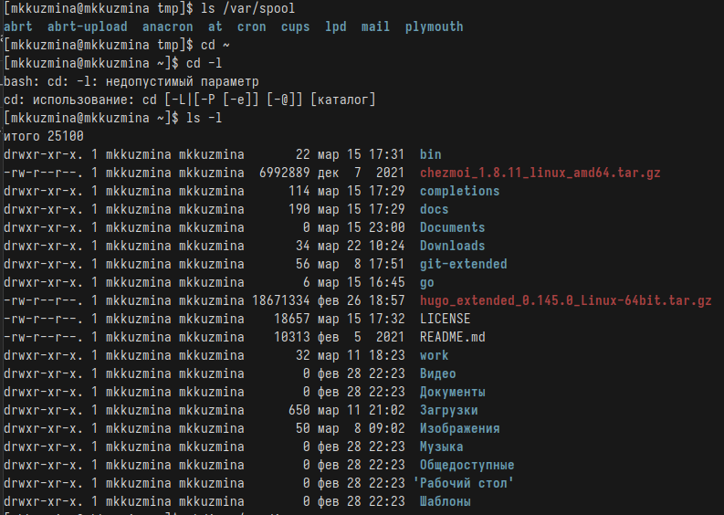
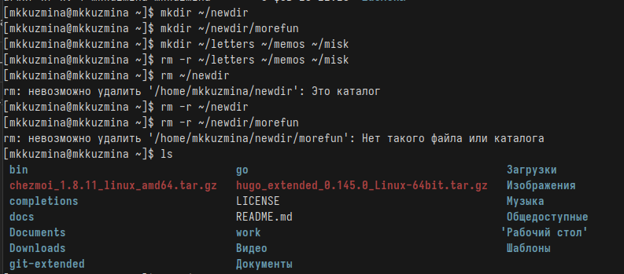
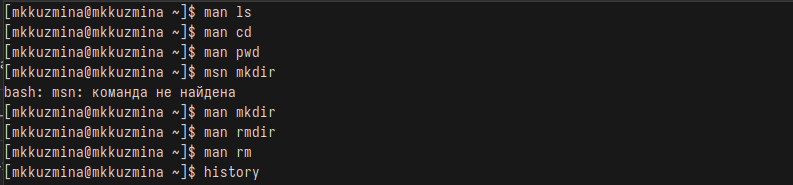
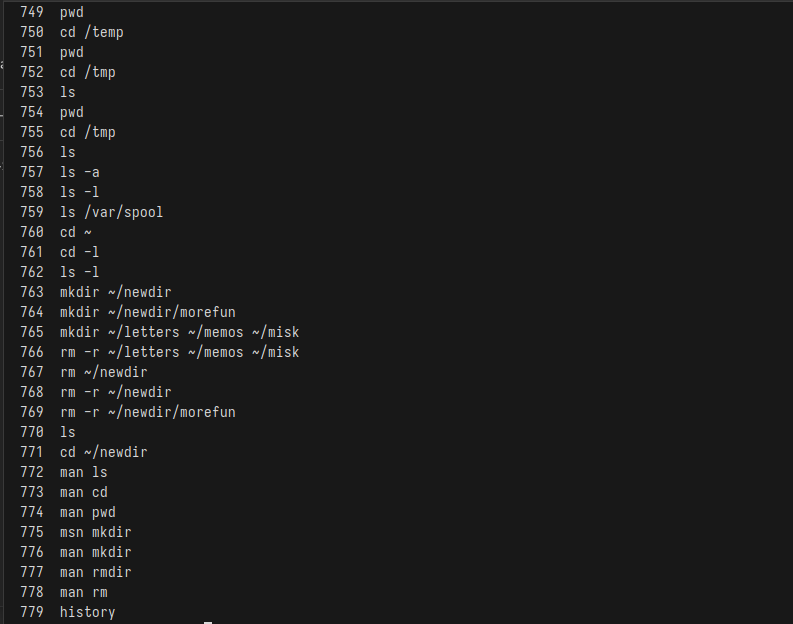
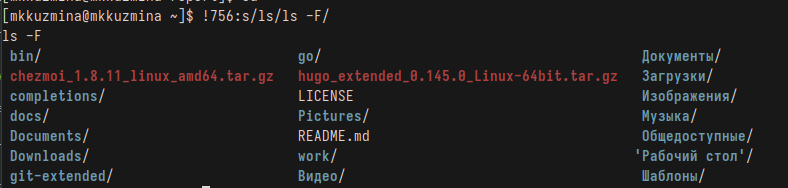

---
## Front matter
lang: ru-RU
title: Лабораторная работа №6
subtitle: Операционные системы
author:
  - Кузьмина М. К.
institute:
  - Российский университет дружбы народов, Москва, Россия
date: 2025

## i18n babel
babel-lang: russian
babel-otherlangs: english

## Formatting pdf
toc: false
toc-title: Содержание
slide_level: 2
aspectratio: 169
section-titles: true
theme: metropolis
header-includes:
 - \metroset{progressbar=frametitle,sectionpage=progressbar,numbering=fraction}
 - '\makeatletter'
 - '\beamer@ignorenonframefalse'
 - '\makeatother'
---

# Цель работы

Приобретение практических навыков взаимодействия пользователя с системой по-
средством командной строки.

# Задание

1. Определить имя домашнего каталога, перейти в каталог, вывести содержимое
3. Создать и удалить каталоги
4. Работа с командой man
5. Посмотреть историю команд и выполнить модификацию

# Выполнение лабораторной работы

## Определить имя домашнего каталога, перейти в каталог, вывести содержимое
Определяем имя домашнего каталога с помощью команды pwd, переходим в каталог /tmp, выводим содержисое с помощью команды ls (-a: показывает скрытые файлы (рис. 1)) 

{#fig:001 width=45%}

## Определить имя домашнего каталога, перейти в каталог, вывести содержимое

(ls -l: выводит подробную информацию о файлах (рис.2)):

{#fig:002 width=50%}

## Создать каталоги

Проверяем наличие подкаталога cron в каталоге /var/spool  с помощью команды ls /var/spool, переходим в домашний каталог и выводим его содержимое командой ls (рис.3), создаем новый каталог newdir в домашнем каталоге с помощью команды mkdir ~/newdir, создаем подкаталог morefun, создаем 3 каталога. 

{#fig:003 width=50%}

## Удалить каталоги

Пробуем удалить каталог newdir командой rm ~/newdir (не получится, так как каталог пустой), затем удаляем его с опцией рекурсивного удаления rm -r, удаляем каталог morefun  (рис.4):

{#fig:004 width=50%}

## Работа с командой man

Определяем с помощью команды man ls, что для просмотра содержимого подкаталога используется опция -R, а для сортировки по времени последнего изменения используется опция -lt, просматриваем описание команд cd, pwd, mkdir,
rmdir, rm с помощью команды man  для каждой  (рис.5):

{#fig:005 width=50%}

## Посмотреть историю команд и выполнить модификацию

Модифицируем (рис.7) и выполняем команды из истории с помощью команды history (рис.6):

{#fig:006 width=50%}

## Посмотреть историю команд и выполнить модификацию

{#fig:007 width=90%}

 

## Выводы

При выполнении данной лабораторной работы были приобретены практические навыки взаимодействия пользователя с системой по-
средством командной строки.

