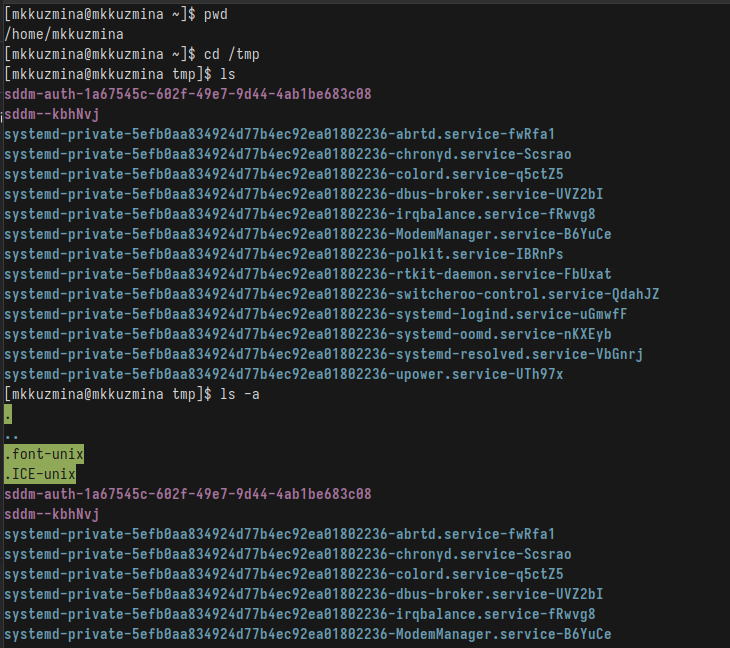
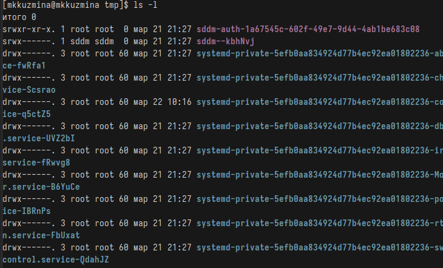
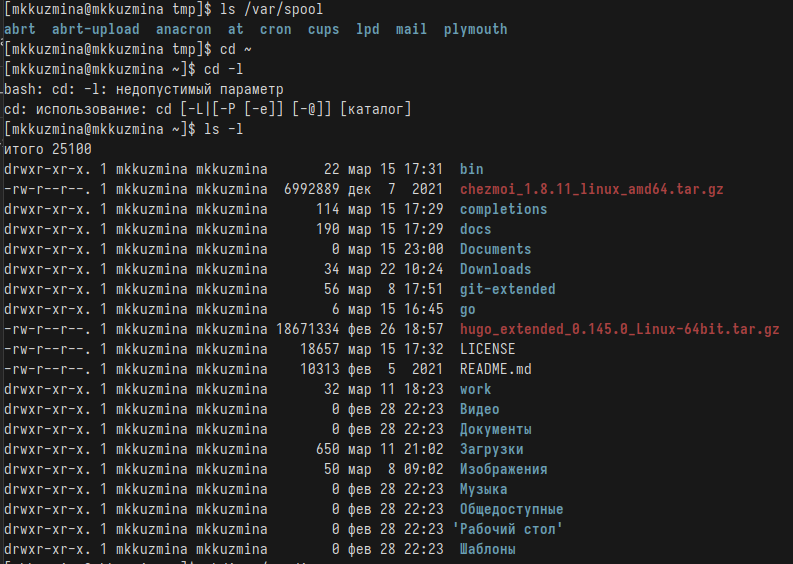
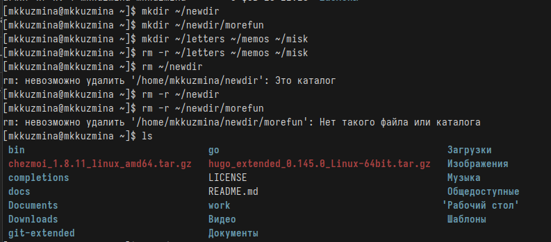
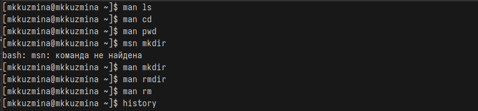
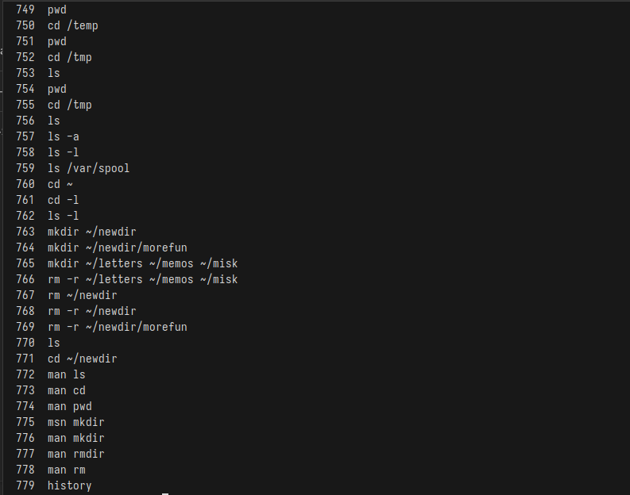
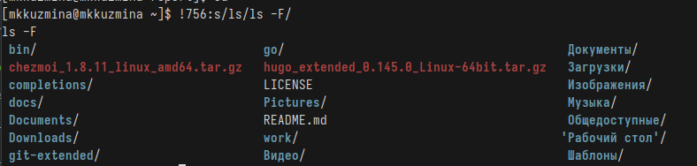

---
## Front matter
title: "Отчёт по лабораторной работе №6"
subtitle: "Дисциплина: Операционные системы"
author: "Кузьмина Мария Константиновна"

## Generic otions
lang: ru-RU
toc-title: "Содержание"

## Bibliography
bibliography: bib/cite.bib

## Pdf output format
toc: true # Table of contents
toc-depth: 2
lof: true # List of figures
fontsize: 12pt
linestretch: 1.5
papersize: a4
documentclass: scrreprt
## I18n polyglossia
polyglossia-lang:
  name: russian
  options:
	- spelling=modern
	- babelshorthands=true
polyglossia-otherlangs:
  name: english
## I18n babel
babel-lang: russian
babel-otherlangs: english
## Fonts
mainfont: IBM Plex Serif
romanfont: IBM Plex Serif
sansfont: IBM Plex Sans
monofont: IBM Plex Mono
mathfont: STIX Two Math
mainfontoptions: Ligatures=Common,Ligatures=TeX,Scale=0.94
romanfontoptions: Ligatures=Common,Ligatures=TeX,Scale=0.94
sansfontoptions: Ligatures=Common,Ligatures=TeX,Scale=MatchLowercase,Scale=0.94
monofontoptions: Scale=MatchLowercase,Scale=0.94,FakeStretch=0.9
mathfontoptions:
## Biblatex
biblatex: true
biblio-style: "gost-numeric"
biblatexoptions:
  - parentracker=true
  - backend=biber
  - hyperref=auto
  - language=auto
  - autolang=other*
  - citestyle=gost-numeric
## Pandoc-crossref LaTeX customization
figureTitle: "Рис."
listingTitle: "Листинг"
lofTitle: "Список иллюстраций"
lolTitle: "Листинги"
## Misc options
indent: true
header-includes:
  - \usepackage{indentfirst}
  - \usepackage{float} # keep figures where there are in the text
  - \floatplacement{figure}{H} # keep figures where there are in the text
---

# Цель работы

Приобретение практических навыков взаимодействия пользователя с системой по-
средством командной строки.

# Задание

1. Определить имя домашнего каталога, перейти в каталог, вывести содержимое
3. Создать и удалить каталоги
4. Работа с командой man
5. Посмотреть историю команд и выполнить модификацию

# Выполнение лабораторной работы

## Определить имя домашнего каталога, перейти в каталог, вывести содержимое
Определяем имя домашнего каталога с помощью команды pwd, переходим в каталог /tmp, выводим содержисое с помощью команды ls (-a: показывает скрытые файлы (рис. [-@fig:001]), -l: выводит подробную информацию о файлах (рис. [-@fig:002])):

{#fig:001 width=100%}

{#fig:002 width=100%}

## Создать и удалить каталоги

Проверяем наличие подкаталога cron в каталоге /var/spool  с помощью команды ls /var/spool, переходим в домашний каталог и выводим его содержимое командой ls (рис. [-@fig:003]), создаем новый каталог newdir в домашнем каталоге с помощью команды mkdir ~/newdir, создаем подкаталог morefun, создаем 3 каталога и удаляем их, пробуем удалить каталог newdir командой rm ~/newdir (не получится, так как каталог пустой), затем удаляем его с опцией рекурсивного удаления rm -r, удаляем каталог morefun  (рис. [-@fig:004]):

{#fig:003 width=100%}

{#fig:004 width=100%}

## Работа с командой man

Определяем с помощью команды man ls, что для просмотра содержимого подкаталога используется опция -R, а для сортировки по времени последнего изменения используется опция -lt, просматриваем описание команд cd, pwd, mkdir,
rmdir, rm с помощью команды man  для каждой  (рис. [-@fig:005]):

{#fig:005 width=100%}

## Посмотреть историю команд и выполнить модификацию

Модифицируем (рис. [-@fig:007]) и выполняем команды из истории с помощью команды history (рис. [-@fig:006]):

{#fig:006 width=100%}

{#fig:007 width=100%}

 
