---
## Front matter
lang: ru-RU
title: Лабораторная работа №7
subtitle: Операционные системы
author:
  - Кузьмина М. К.
institute:
  - Российский университет дружбы народов, Москва, Россия
date: 2025

## i18n babel
babel-lang: russian
babel-otherlangs: english

## Formatting pdf
toc: false
toc-title: Содержание
slide_level: 2
aspectratio: 169
section-titles: true
theme: metropolis
header-includes:
 - \metroset{progressbar=frametitle,sectionpage=progressbar,numbering=fraction}
 - '\makeatletter'
 - '\beamer@ignorenonframefalse'
 - '\makeatother'
---

# Цель работы

Ознакомление с файловой системой Linux, её структурой, именами и содержанием каталогов. Приобретение практических навыков по применению команд для работы с файлами и каталогами, по управлению процессами (и работами), по проверке использования диска и обслуживанию файловой системы.

# Задание

1. Выполнить все примеры, приведенные в первой части описания лабораторной работы
3. Выполнить указанные действия
4. Определить опции для команды chmod
5. Выполнить указанные действия
6. Написать краткую характеристику комнад

# Выполнение лабораторной работы

## Выполнить все примеры, приведенные в первой части описания лабораторной работы
Копируем файл ~/abc1 в файл april в файл may, копируем файлы april и may в каталог monthly, копируем файл monthly/may в файл с именем june(рис.1)

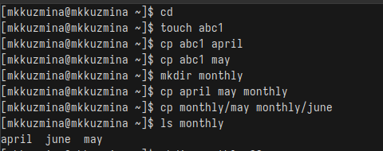{#fig:001 width=80%}

## Выполнить все примеры, приведенные в первой части описания лабораторной работы

Копируем каталог monthly в каталог monthly.00, копируем каталог monthly.00 в каталог /tmp, меняем название файла april на july в домашнем каталоге, перемещаем файл july в каталог monthly.00 (рис.2)

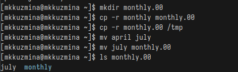{#fig:002 width=80%}

## Выполнить все примеры, приведенные в первой части описания лабораторной работы

Переименовываем каталог monthly.00 в monthly.01, перемещаем каталог monthly.01 в каталог reports, переименовываем каталог reports/monthly.01 в reports/monthly (рис.3):

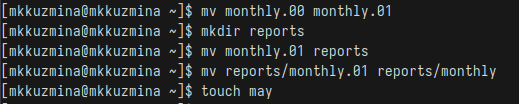{#fig:003 width=90%}

## Выполнить все примеры, приведенные в первой части описания лабораторной работы

Создаем файл ~/may с правом выполнения для владельца, потом лишаем владельца права на выполнение (рис.4):

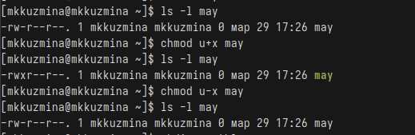{#fig:004 width=90%}

## Выполнить все примеры, приведенные в первой части описания лабораторной работы

Создаем каталог monthly с запретом на чтение для членов группы и всех остальных пользователей, затем создаем файл ~/abc1 с правом записи для членов группы (рис.5):

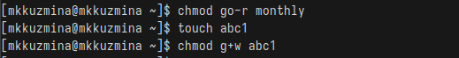{#fig:005 width=90%}

## Выполнить указанные действия

Копируем файл /usr/include/sys/io.h в домашний каталог и называем его equipment (рис.6):

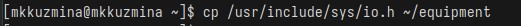{#fig:006 width=90%}

## Выполнить указанные действия

Создаем директорию ~/ski.plases, перемещаем файл equipment в каталог ~/ski.plases, переименовываем файл ~/ski.plases/equipment в ~/ski.plases/equiplist (рис.7):

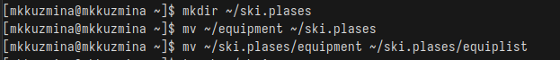{#fig:007 width=90%}

## Выполнить указанные действия

Создаем файл abc1 в домашнем каталоге и копируем его в каталог ~/ski.plases, называем его equiplist2, создаем каталог с именем equipment в каталоге ~/ski.plases, перемещаем файлы ~/ski.plases/equiplist и equiplist2 в каталог ~/ski.plases/equipment, создаем и перемещаем каталог ~/newdir в каталог ~/ski.plases и называем его plans (рис.8):

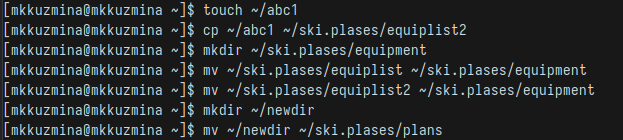{#fig:008 width=90%}

## Определить опции для команды chmod

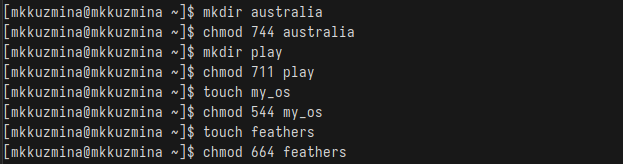{#fig:009 width=90%}

## Выполнить указанные действия

Смотрим содержание файла /etc/passwd (рис.10):

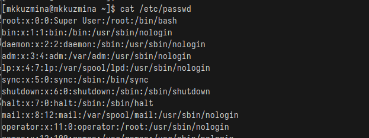{#fig:010 width=90%}

## Выполнить указанные действия

Копируем файл ~/feathers в файл ~/file.old, перемещаем файл ~/file.old в каталог ~/play, копируем каталог ~/play в каталог ~/fun, перемещаем каталог ~/fun в каталог ~/play и называем его games, лишаем владельца файла ~/feathers права на чтение, пробуем просмотреть файл ~/feathers командой cat (команда возвращает ошибку) (рис.11):

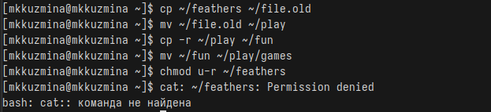{#fig:011 width=90%}

## Выполнить указанные действия

Пробуем скопировать файл ~/feathers (скопировать файл получится, т.к. для копирования достаточно прав на чтение у группы или других пользователей), даем владельцу файла ~/feathers право на чтение, лишаем владельца каталога ~/play права на выполнение, пробуем перейти в каталог ~/play (команда возвращает ошибку), даем владельцу каталога ~/play право на выполнение (рис.12,13):

## Выполнить указанные действия

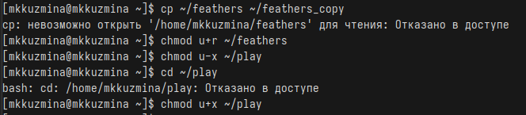{#fig:012 width=90%}

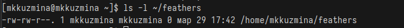{#fig:013 width=90%}

## Написать краткую характеристику комнад

mount - монтирование файловых систем (mount /dev/sda1 /mnt)

fsck — проверка целостности файловой системы (fsck /dev/sda1)

mkfs — создание новой файловой системы (mkfs.ext4 /dev/sda1)

kill — завершение процесса по PID (kill 1234)

## Выводы
При выполнение лабораторной работы я ознакомилась с файловой системой Linux, её структурой, именами и содержанием каталогов. Приобрела практические навыки по применению команд для работы с файлами и каталогами, по управлению процессами (и работами), по проверке использования диска и обслуживанию файловой системы.