---
## Front matter
title: "Отчёт по лабораторной работе №7"
subtitle: "Дисциплина: Операционные системы"
author: "Кузьмина Мария Константиновна"

## Generic otions
lang: ru-RU
toc-title: "Содержание"

## Bibliography
bibliography: bib/cite.bib

## Pdf output format
toc: true # Table of contents
toc-depth: 2
lof: true # List of figures
fontsize: 12pt
linestretch: 1.5
papersize: a4
documentclass: scrreprt
## I18n polyglossia
polyglossia-lang:
  name: russian
  options:
	- spelling=modern
	- babelshorthands=true
polyglossia-otherlangs:
  name: english
## I18n babel
babel-lang: russian
babel-otherlangs: english
## Fonts
mainfont: IBM Plex Serif
romanfont: IBM Plex Serif
sansfont: IBM Plex Sans
monofont: IBM Plex Mono
mathfont: STIX Two Math
mainfontoptions: Ligatures=Common,Ligatures=TeX,Scale=0.94
romanfontoptions: Ligatures=Common,Ligatures=TeX,Scale=0.94
sansfontoptions: Ligatures=Common,Ligatures=TeX,Scale=MatchLowercase,Scale=0.94
monofontoptions: Scale=MatchLowercase,Scale=0.94,FakeStretch=0.9
mathfontoptions:
## Biblatex
biblatex: true
biblio-style: "gost-numeric"
biblatexoptions:
  - parentracker=true
  - backend=biber
  - hyperref=auto
  - language=auto
  - autolang=other*
  - citestyle=gost-numeric
## Pandoc-crossref LaTeX customization
figureTitle: "Рис."
listingTitle: "Листинг"
lofTitle: "Список иллюстраций"
lolTitle: "Листинги"
## Misc options
indent: true
header-includes:
  - \usepackage{indentfirst}
  - \usepackage{float} # keep figures where there are in the text
  - \floatplacement{figure}{H} # keep figures where there are in the text
---

# Цель работы

Ознакомление с файловой системой Linux, её структурой, именами и содержанием каталогов. Приобретение практических навыков по применению команд для работы с файлами и каталогами, по управлению процессами (и работами), по проверке использования диска и обслуживанию файловой системы.

# Задание

1. Выполнить все примеры, приведенные в первой части описания лабораторной работы
3. Выполнить указанные действия
4. Определить опции для команды chmod
5. Выполнить указанные действия
6. Написать краткую характеристику комнад

# Выполнение лабораторной работы

## Выполнить все примеры, приведенные в первой части описания лабораторной работы
Копируем файл ~/abc1 в файл april в файл may, копируем файлы april и may в каталог monthly, копируем файл monthly/may в файл с именем june(рис. [-@fig:001])

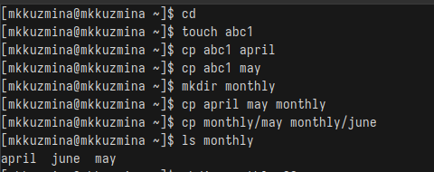{#fig:001 width=100%}

Копируем каталог monthly в каталог monthly.00, копируем каталог monthly.00 в каталог /tmp, меняем название файла april на july в домашнем каталоге, перемещаем файл july в каталог monthly.00 (рис. [-@fig:002])

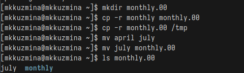{#fig:002 width=100%}

Переименовываем каталог monthly.00 в monthly.01, перемещаем каталог monthly.01 в каталог reports, переименовываем каталог reports/monthly.01 в reports/monthly (рис. [-@fig:003]):

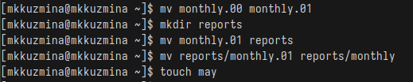{#fig:003 width=100%}

Создаем файл ~/may с правом выполнения для владельца, потом лишаем владельца права на выполнение (рис. [-@fig:004]):

{#fig:004 width=100%}

Создаем каталог monthly с запретом на чтение для членов группы и всех остальных пользователей, затем создаем файл ~/abc1 с правом записи для членов группы (рис. [-@fig:005]):

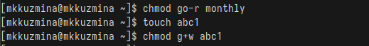{#fig:005 width=100%}

## Выполнить указанные действия

Копируем файл /usr/include/sys/io.h в домашний каталог и называем его equipment (рис. [-@fig:006]):

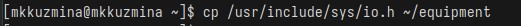{#fig:006 width=100%}

Создаем директорию ~/ski.plases, перемещаем файл equipment в каталог ~/ski.plases, переименовываем файл ~/ski.plases/equipment в ~/ski.plases/equiplist (рис. [-@fig:007]):

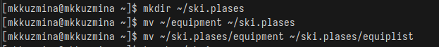{#fig:007 width=100%}

Создаем файл abc1 в домашнем каталоге и копируем его в каталог ~/ski.plases, называем его equiplist2, создаем каталог с именем equipment в каталоге ~/ski.plases, перемещаем файлы ~/ski.plases/equiplist и equiplist2 в каталог ~/ski.plases/equipment, создаем и перемещаем каталог ~/newdir в каталог ~/ski.plases и называем его plans (рис. [-@fig:008]):

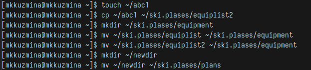{#fig:008 width=100%}

## Определить опции для команды chmod

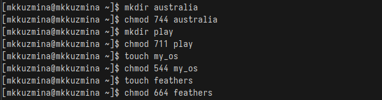{#fig:009 width=100%}

## Выполнить указанные действия

Смотрим содержание файла /etc/passwd (рис. [-@fig:010]):

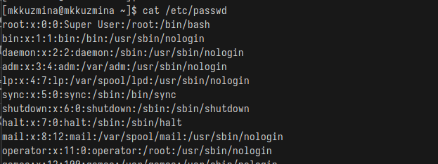{#fig:010 width=100%}

Копируем файл ~/feathers в файл ~/file.old, перемещаем файл ~/file.old в каталог ~/play, копируем каталог ~/play в каталог ~/fun, перемещаем каталог ~/fun в каталог ~/play и называем его games, лишаем владельца файла ~/feathers права на чтение, пробуем просмотреть файл ~/feathers командой cat (команда возвращает ошибку) (рис. [-@fig:011]):

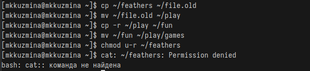{#fig:011 width=100%}

Пробуем скопировать файл ~/feathers (скопировать файл получится, т.к. для копирования достаточно прав на чтение у группы или других пользователей), даем владельцу файла ~/feathers право на чтение, лишаем владельца каталога ~/play права на выполнение, пробуем перейти в каталог ~/play (команда возвращает ошибку), даем владельцу каталога ~/play право на выполнение (рис. [-@fig:012]):

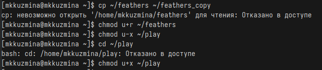{#fig:012 width=100%}

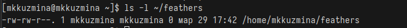{#fig:013 width=100%}

## Написать краткую характеристику комнад

mount - монтирование файловых систем (mount /dev/sda1 /mnt)

fsck — проверка целостности файловой системы (fsck /dev/sda1)

mkfs — создание новой файловой системы (mkfs.ext4 /dev/sda1)

kill — завершение процесса по PID (kill 1234)

## Выводы
При выполнение лабораторной работы я ознакомилась с файловой системой Linux, её структурой, именами и содержанием каталогов. Приобрела практические навыки по применению команд для работы с файлами и каталогами, по управлению процессами (и работами), по проверке использования диска и обслуживанию файловой системы.