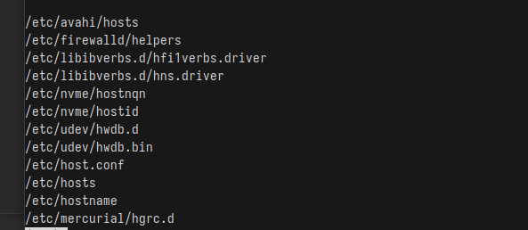

---
## Front matter
lang: ru-RU
title: Лабораторная работа №8
subtitle: Операционные системы
author:
  - Кузьмина М. К.
institute:
  - Российский университет дружбы народов, Москва, Россия
date: 2025

## i18n babel
babel-lang: russian
babel-otherlangs: english

## Formatting pdf
toc: false
toc-title: Содержание
slide_level: 2
aspectratio: 169
section-titles: true
theme: metropolis
header-includes:
 - \metroset{progressbar=frametitle,sectionpage=progressbar,numbering=fraction}
 - '\makeatletter'
 - '\beamer@ignorenonframefalse'
 - '\makeatother'
---

# Задание

1. Записать в файл file.txt список файлов из /etc и домашнего каталога (~).
2. Вывести имена всех файлов из file.txt, имеющих расширение .conf, и записать их в conf.txt.
3. Найти файлы в домашнем каталоге, начинающиеся с c.
4. Вывести на экран (постранично) имена файлов из /etc, начинающиеся с h.
5. Запустить в фоновом режиме процесс, который записывает в ~/logfile файлы, начинающиеся с log.
6. Удалить ~/logfile.
7. Запустить редактор nano в фоновом режиме, определить PID процесса nano.
8. Завершить процесс nano с помощью kill.
9. Проверить использование диска (df) и размер каталогов (du).
10. Найти все директории в домашнем каталоге.

# Выполнение лабораторной работы

## Записать в файл file.txt список файлов из /etc и домашнего каталога (~).
Ищем все файлы (-type f) в указанных каталогах (/etc и ~) и записываем их в file.txt (рис.1), (рис.2):

{#fig:001 width=80%}

{#fig:002 width=80%}

## Вывести имена всех файлов из file.txt, имеющих расширение .conf, и записать их в conf.txt.

Ищем строки с .conf в file.txt и записываем их в conf.txt (рис.3):

{#fig:003 width=90%}

## Найти файлы в домашнем каталоге, начинающиеся с c.

Ищем файлы и каталоги, начинающиеся с c, в домашнем каталоге (рис.4):

{#fig:004 width=90%}

## Вывести на экран (постранично) имена файлов из /etc, начинающиеся с h.

Ищем файлы в /etc, начинающиеся с h, и выводим их постранично (less) (рис.5:

{#fig:005 width=80%}

{#fig:006 width=60%}

## Запустить в фоновом режиме процесс, который записывает в ~/logfile файлы, начинающиеся с log.

Запускаем поиск файлов, начинающихся с log, и записываем их в ~/logfile. & – фоновый режим (рис.7):

{#fig:007 width=90%}

## Удалить ~/logfile.

Удаляем файл ~/logfile (рис.8):

{#fig:008 width=90%}

## Запустить редактор nano в фоновом режиме, определить PID процесса nano. 

Запускаем nano в фоновом режиме (рис.9):

{#fig:009 width=90%}

## Завершить процесс nano с помощью kill.

Завершаем процесс с указанным PID (рис.10):

{#fig:010 width=90%}

## Проверить использование диска (df) и размер каталогов (du).

Открываем справку (рис.11) и запускаем команды (рис.12), (рис. 13):

{#fig:011 width=58%}

{#fig:012 width=56%}

{#fig:013 width=55%}

## Найти все директории в домашнем каталоге.

Ищем и выводим список всех директорий (-type d) в домашнем каталоге (рис.14):

{#fig:014 width=90%}

## Выводы
При выполнение лабораторной работы я ознакомилась с инструментами поиска файлов и фильтрации текстовых данных.Приобрела практические навыки: по управлению процессами (и заданиями), по проверке использования диска и обслуживанию файловых систем.