---
## Front matter
title: "Отчёт по лабораторной работе №8"
subtitle: "Дисциплина: Операционные системы"
author: "Кузьмина Мария Константиновна"

## Generic otions
lang: ru-RU
toc-title: "Содержание"

## Bibliography
bibliography: bib/cite.bib

## Pdf output format
toc: true # Table of contents
toc-depth: 2
lof: true # List of figures
fontsize: 12pt
linestretch: 1.5
papersize: a4
documentclass: scrreprt
## I18n polyglossia
polyglossia-lang:
  name: russian
  options:
	- spelling=modern
	- babelshorthands=true
polyglossia-otherlangs:
  name: english
## I18n babel
babel-lang: russian
babel-otherlangs: english
## Fonts
mainfont: IBM Plex Serif
romanfont: IBM Plex Serif
sansfont: IBM Plex Sans
monofont: IBM Plex Mono
mathfont: STIX Two Math
mainfontoptions: Ligatures=Common,Ligatures=TeX,Scale=0.94
romanfontoptions: Ligatures=Common,Ligatures=TeX,Scale=0.94
sansfontoptions: Ligatures=Common,Ligatures=TeX,Scale=MatchLowercase,Scale=0.94
monofontoptions: Scale=MatchLowercase,Scale=0.94,FakeStretch=0.9
mathfontoptions:
## Biblatex
biblatex: true
biblio-style: "gost-numeric"
biblatexoptions:
  - parentracker=true
  - backend=biber
  - hyperref=auto
  - language=auto
  - autolang=other*
  - citestyle=gost-numeric
## Pandoc-crossref LaTeX customization
figureTitle: "Рис."
listingTitle: "Листинг"
lofTitle: "Список иллюстраций"
lolTitle: "Листинги"
## Misc options
indent: true
header-includes:
  - \usepackage{indentfirst}
  - \usepackage{float} # keep figures where there are in the text
  - \floatplacement{figure}{H} # keep figures where there are in the text
---

# Цель работы

Ознакомление с инструментами поиска файлов и фильтрации текстовых данных.Приобретение практических навыков: по управлению процессами (и заданиями), по проверке использования диска и обслуживанию файловых систем.

# Задание

1. Записать в файл file.txt список файлов из /etc и домашнего каталога (~).
2. Вывести имена всех файлов из file.txt, имеющих расширение .conf, и записать их в conf.txt.
3. Найти файлы в домашнем каталоге, начинающиеся с c.
4. Вывести на экран (постранично) имена файлов из /etc, начинающиеся с h.
5. Запустить в фоновом режиме процесс, который записывает в ~/logfile файлы, начинающиеся с log.
6. Удалить ~/logfile.
7. Запустить редактор nano в фоновом режиме, определить PID процесса nano.
8. Завершить процесс nano с помощью kill.
9. Проверить использование диска (df) и размер каталогов (du).
10. Найти все директории в домашнем каталоге.

# Выполнение лабораторной работы

## Записать в файл file.txt список файлов из /etc и домашнего каталога (~).
Ищем все файлы (-type f) в указанных каталогах (/etc и ~) и записываем их в file.txt (рис. [-@fig:001]), (рис. [-@fig:002]):

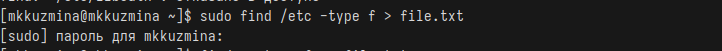{#fig:001 width=100%}

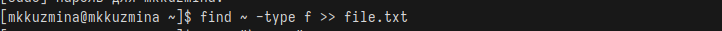{#fig:002 width=100%}

## Вывести имена всех файлов из file.txt, имеющих расширение .conf, и записать их в conf.txt.

Ищем строки с .conf в file.txt и записываем их в conf.txt (рис. [-@fig:003]):

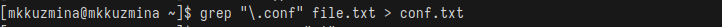{#fig:003 width=100%}

## Найти файлы в домашнем каталоге, начинающиеся с c.

Ищем файлы и каталоги, начинающиеся с c, в домашнем каталоге (рис. [-@fig:004]):

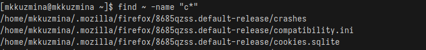{#fig:004 width=100%}

## Вывести на экран (постранично) имена файлов из /etc, начинающиеся с h.

Ищем файлы в /etc, начинающиеся с h, и выводим их постранично (less) (рис. [-@fig:005]):

{#fig:005 width=100%}

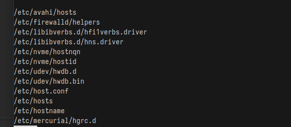{#fig:006 width=100%}

## Запустить в фоновом режиме процесс, который записывает в ~/logfile файлы, начинающиеся с log.

Запускаем поиск файлов, начинающихся с log, и записываем их в ~/logfile. & – фоновый режим (рис. [-@fig:007]):

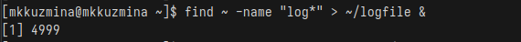{#fig:007 width=100%}

## Удалить ~/logfile.

Удаляем файл ~/logfile (рис. [-@fig:008]):

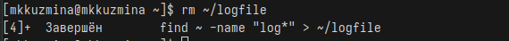{#fig:008 width=100%}

## Запустить редактор nano в фоновом режиме, определить PID процесса nano. 

Запускаем nano в фоновом режиме (рис. [-@fig:009]):

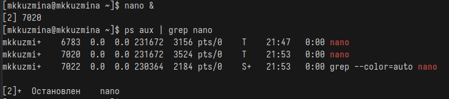{#fig:009 width=100%}

## Завершить процесс nano с помощью kill.

Завершаем процесс с указанным PID (рис. [-@fig:010]):

{#fig:010 width=100%}

## Проверить использование диска (df) и размер каталогов (du).

Открываем справку (рис. [-@fig:011]) и запускаем команды (рис. [-@fig:012]), (рис. [-@fig:013]):

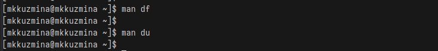{#fig:011 width=100%}

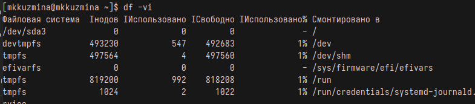{#fig:012 width=100%}

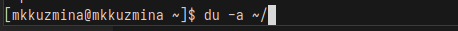{#fig:013 width=100%}

## Найти все директории в домашнем каталоге.

Ищем и выводим список всех директорий (-type d) в домашнем каталоге (рис. [-@fig:014]):

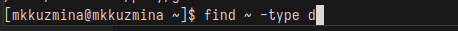{#fig:014 width=100%}

## Выводы
При выполнение лабораторной работы я ознакомилась с инструментами поиска файлов и фильтрации текстовых данных.Приобрела практические навыки: по управлению процессами (и заданиями), по проверке использования диска и обслуживанию файловых систем.