---
## Front matter
lang: ru-RU
title: Лабораторная работа №9
subtitle: Операционные системы
author:
  - Кузьмина М. К.
institute:
  - Российский университет дружбы народов, Москва, Россия
date: 2025

## i18n babel
babel-lang: russian
babel-otherlangs: english

## Formatting pdf
toc: false
toc-title: Содержание
slide_level: 2
aspectratio: 169
section-titles: true
theme: metropolis
header-includes:
 - \metroset{progressbar=frametitle,sectionpage=progressbar,numbering=fraction}
 - '\makeatletter'
 - '\beamer@ignorenonframefalse'
 - '\makeatother'
---

# Цель работы

Освоение основных возможностей командной оболочки Midnight Commander. Приобретение навыков практической работы по просмотру каталогов и файлов; манипуляций с ними.

# Задание

1. Создать текстовый файл text.txt
2. Открыть файл tetx.txt в mc
3. Вставить в файл небольшой фрагмент текста, скопированный из интернета
4. Проделать с файлом несколько манипуляций
5. Открыть файл с исходным текстом на языке С
6. Отключить подсветку синтаксиса

# Выполнение лабораторной работы

## Создать текстовый файл text.txt
Создаем текстовый файл (рис.1):

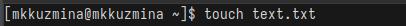{#fig:001 width=100%}

## Открыть файл tetx.txt в mc

Открываем файл в mc (рис.2), (рис.3):

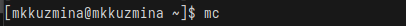{#fig:002 width=100%}

## Открыть файл tetx.txt в mc

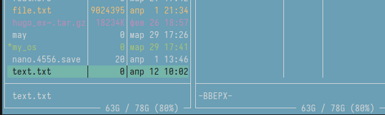{#fig:003 width=100%}

## Вставить в файл небольшой фрагмент текста, скопированный из интернета

Вставляем в файл скопированный из интернета текс(рис.4):

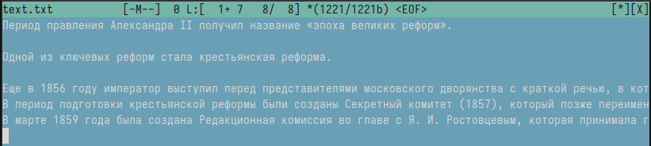{#fig:004 width=100%}

## Проделать с файлом несколько манипуляций

Устанавливаем курсор на строку и комбинацией ctrl+y удаляем ее (рис.5):

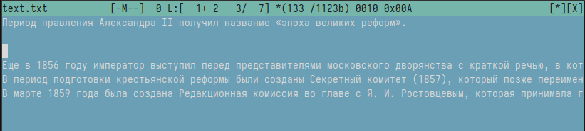{#fig:005 width=100%}

## Проделать с файлом несколько манипуляций

Выделяем фрагмент текста с помощью fn+f3 (рис.6)

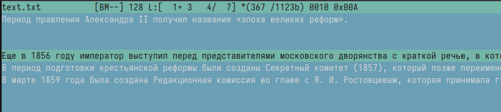{#fig:006 width=100%}

## Проделать с файлом несколько манипуляций

Копируем фрагмент с помощью fn+f5 и нажимаем enter (рис.7)

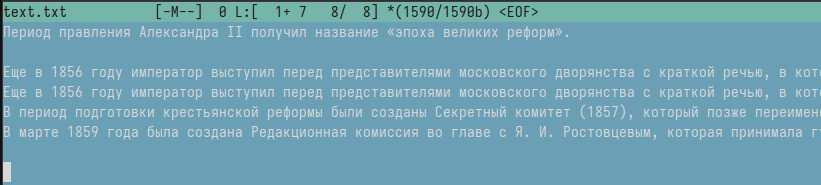{#fig:007 width=100%}

## Проделать с файлом несколько манипуляций

Cохраняем файл с помощью fn+f2 (рис.8):

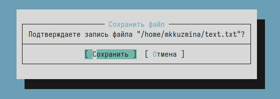{#fig:008 width=100%}

## Проделать с файлом несколько манипуляций

Переходим в конец файла, пишем "Это конец файла"; переходим в начало файла, пишем "Это начало файла" (рис.9):

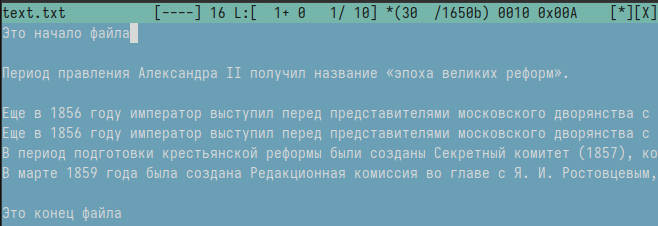{#fig:009 width=100%}

## Открыть файл с исходным текстом на языке С

Открываем файл с кодом (рис.10):

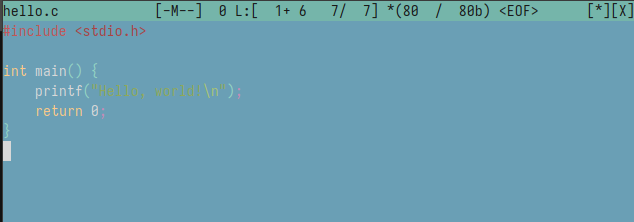{#fig:010 width=100%}

## Отключить подсветку синтаксиса

Отключаем подсветку синтаксиса (рис.11):

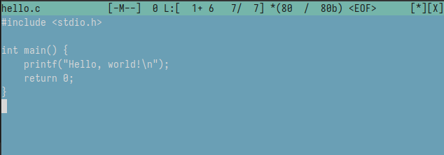{#fig:011 width=100%}

## Выводы
При выполнении лабораторной работы я освоила основные возможности командной оболочки Midnight Commander. Приобрела навыки практической работы по просмотру каталогов и файлов; манипуляций с ними.
