---
## Front matter
title: "Отчёт по лабораторной работе №9"
subtitle: "Дисциплина: Операционные системы"
author: "Кузьмина Мария Константиновна"

## Generic otions
lang: ru-RU
toc-title: "Содержание"

## Bibliography
bibliography: bib/cite.bib

## Pdf output format
toc: true # Table of contents
toc-depth: 2
lof: true # List of figures
fontsize: 12pt
linestretch: 1.5
papersize: a4
documentclass: scrreprt
## I18n polyglossia
polyglossia-lang:
  name: russian
  options:
	- spelling=modern
	- babelshorthands=true
polyglossia-otherlangs:
  name: english
## I18n babel
babel-lang: russian
babel-otherlangs: english
## Fonts
mainfont: IBM Plex Serif
romanfont: IBM Plex Serif
sansfont: IBM Plex Sans
monofont: IBM Plex Mono
mathfont: STIX Two Math
mainfontoptions: Ligatures=Common,Ligatures=TeX,Scale=0.94
romanfontoptions: Ligatures=Common,Ligatures=TeX,Scale=0.94
sansfontoptions: Ligatures=Common,Ligatures=TeX,Scale=MatchLowercase,Scale=0.94
monofontoptions: Scale=MatchLowercase,Scale=0.94,FakeStretch=0.9
mathfontoptions:
## Biblatex
biblatex: true
biblio-style: "gost-numeric"
biblatexoptions:
  - parentracker=true
  - backend=biber
  - hyperref=auto
  - language=auto
  - autolang=other*
  - citestyle=gost-numeric
## Pandoc-crossref LaTeX customization
figureTitle: "Рис."
listingTitle: "Листинг"
lofTitle: "Список иллюстраций"
lolTitle: "Листинги"
## Misc options
indent: true
header-includes:
  - \usepackage{indentfirst}
  - \usepackage{float} # keep figures where there are in the text
  - \floatplacement{figure}{H} # keep figures where there are in the text
---

# Цель работы

Освоение основных возможностей командной оболочки Midnight Commander. Приобретение навыков практической работы по просмотру каталогов и файлов; манипуляций с ними.

# Задание

1. Создать текстовый файл text.txt
2. Открыть файл tetx.txt в mc
3. Вставить в файл небольшой фрагмент текста, скопированный из интернета
4. Проделать с файлом несколько манипуляций
5. Открыть файл с исходным текстом на языке С
6. Отключить подсветку синтаксиса

# Выполнение лабораторной работы

## Создать текстовый файл text.txt
Создаем текстовый файл (рис. [-@fig:001]):

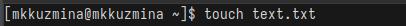{#fig:001 width=100%}

## Открыть файл tetx.txt в mc

Открываем файл в mc (рис. [-@fig:002]), (рис. [-@fig:003]):

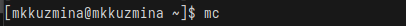{#fig:002 width=100%}

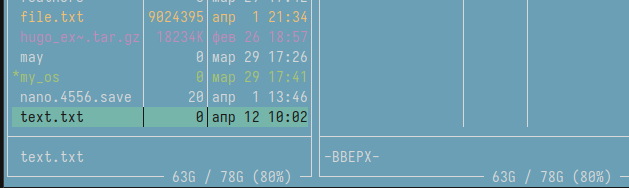{#fig:003 width=100%}

## Вставить в файл небольшой фрагмент текста, скопированный из интернета

Вставляем в файл скопированный из интернета текс(рис. [-@fig:004]):

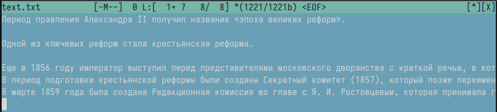{#fig:004 width=100%}

## Проделать с файлом несколько манипуляций

Устанавливаем курсор на строку и комбинацией ctrl+y удаляем ее (рис. [-@fig:005]):

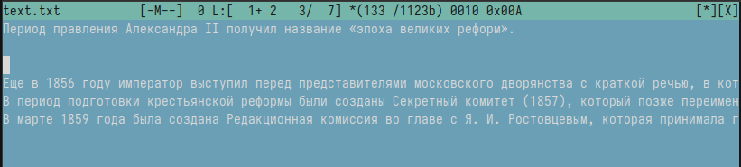{#fig:005 width=100%}

Выделяем фрагмент текста с помощью fn+f3 (рис. [-@fig:006]), копируем с помощью fn+f5 и нажимаем enter (рис. [-@fig:007])

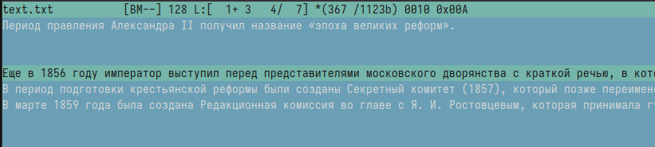{#fig:006 width=100%}

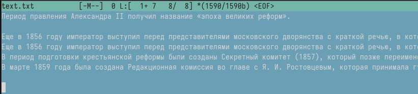{#fig:007 width=100%}

Cохраняем файл с помощью fn+f2 (рис. [-@fig:008]):

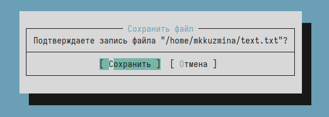{#fig:008 width=100%}

Переходим в конец файла, пишем "Это конец файла"; переходим в начало файла, пишем "Это начало файла" (рис. [-@fig:009]):

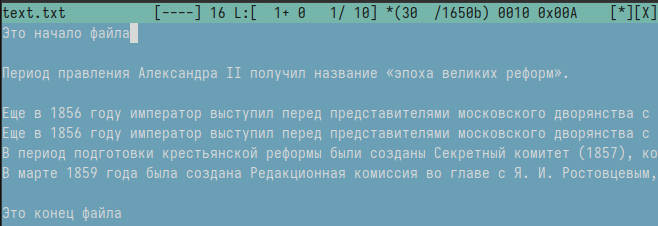{#fig:009 width=100%}

## Открыть файл с исходным текстом на языке С

Открываем файл с кодом (рис. [-@fig:010]):

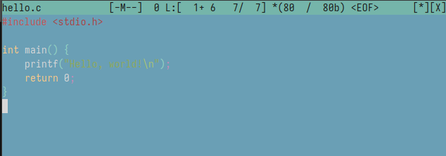{#fig:010 width=100%}

## Отключить подсветку синтаксиса

Отключаем подсветку синтаксиса (рис. [-@fig:011]):

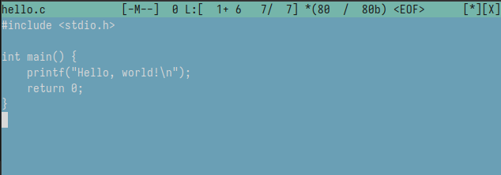{#fig:011 width=100%}

## Выводы
При выполнении лабораторной работы я освоила основные возможности командной оболочки Midnight Commander. Приобрела навыки практической работы по просмотру каталогов и файлов; манипуляций с ними.