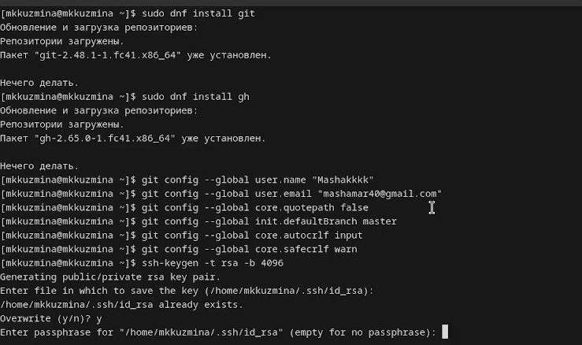
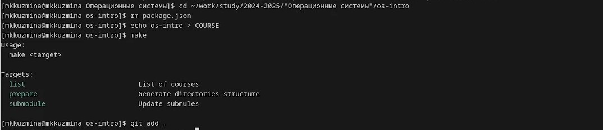
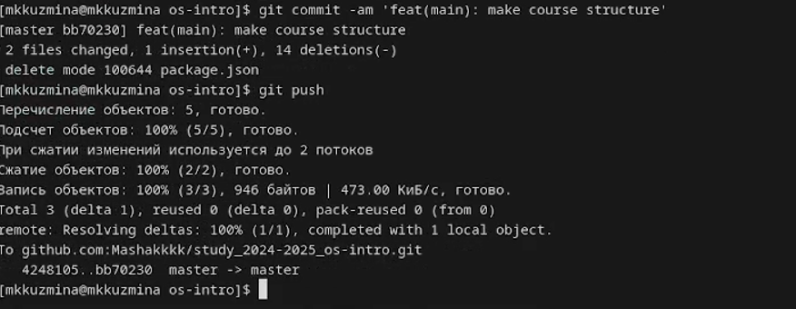

---
## Front matter
lang: ru-RU
title: Лабораторная работа №2
subtitle: Операционные системы
author:
  - Кузьмина М. К.
institute:
  - Российский университет дружбы народов, Москва, Россия
date: 2025

## i18n babel
babel-lang: russian
babel-otherlangs: english

## Formatting pdf
toc: false
toc-title: Содержание
slide_level: 2
aspectratio: 169
section-titles: true
theme: metropolis
header-includes:
 - \metroset{progressbar=frametitle,sectionpage=progressbar,numbering=fraction}
 - '\makeatletter'
 - '\beamer@ignorenonframefalse'
 - '\makeatother'
---

## Цель работы

Цель данной лабораторной работы -- изучение идеологии и применения средств контроля версий, освоение умения по работе с git.

## Задание

1. Создать базовую конфигурацию для работы с git.
2. Создать ключ SSH.
3. Создать ключ PGP.
4. Создать локальный каталог для выполнения заданий по предмету.
5. Настроить каталог курса

## Создание базовой конфигурации для работы с git.

Устанавливаем git, gh, задаем имя и email владельца репозитория, настраиваем utf-8 в выводе сообщений git, задаем имя начальной ветки,:(рис.1):

{#fig:001 width=50%}

## Создание ключа SSH.

Создаем ssh ключ (рис.2):

{#fig:002 width=100%}

## Создание ключа PGP

Создаем ключ и выбираем из предложенных опций тип, размер, срок действия (рис.3:

{#fig:003 width=60%}

Выводим список ключей и копируем отпечаток приватного ключа, копируем наш сгенерированный PGP ключ в буфер обмена, переходим на гитхаб и вставляем скопированный ключ, используя введёный email, указываем Git применять его при подписи коммитов (рис.4):

{#fig:004 width=100%}

## Создание локального каталога для выполнения заданий по предмету.

создаём директорию для работы, переходим в созданную директорию, создаём репозиторий на GitHub с указанным шаблоном и делает его публичным, клонируем созданный репозиторий в локальную папку os- с загрузкой всех подмодулей (--recursive).(рис.5):

{#fig:005 width=100%}

## Настройка каталога курса

Переходим в каталог, удаляем лишние файлы, создаем необходимые каталоги (рис.6):

{#fig:006 width=45%}

отправляем на сервер (рис.7):

{#fig:007 width=45%}

## Выводы

При выполнении данной лабораторной работы была изучена идеология и применение средств контроля версий

