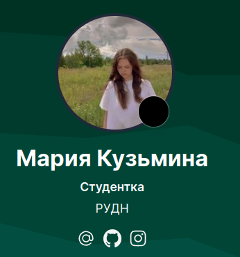
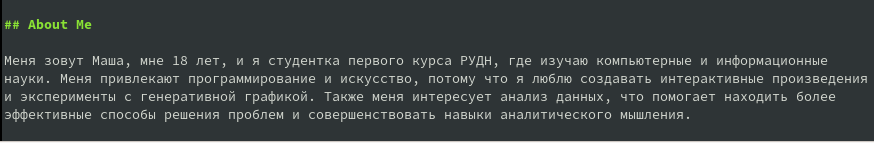
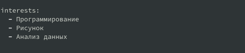
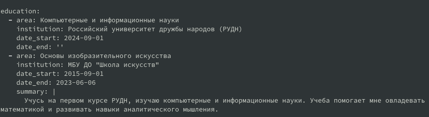
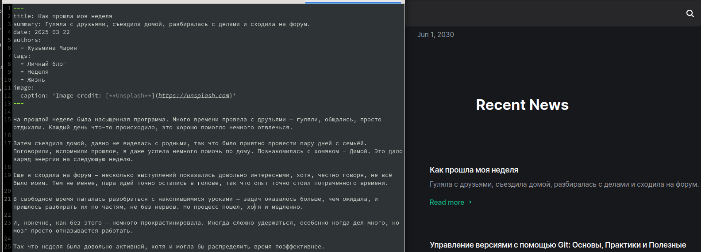
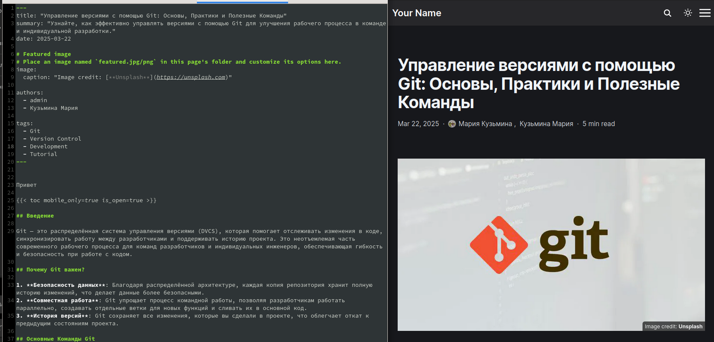

---
## Front matter
lang: ru-RU
title: Индивидуальный проект, шаг №2
subtitle: Операционные системы
author:
  - Кузьмина М. К.
institute:
  - Российский университет дружбы народов, Москва, Россия
date: 2025

## i18n babel
babel-lang: russian
babel-otherlangs: english

## Formatting pdf
toc: false
toc-title: Содержание
slide_level: 2
aspectratio: 169
section-titles: true
theme: metropolis
header-includes:
 - \metroset{progressbar=frametitle,sectionpage=progressbar,numbering=fraction}
 - '\makeatletter'
 - '\beamer@ignorenonframefalse'
 - '\makeatother'
---

# Выполнение работы

## Разместить фотографию владельца сайта.

Размещаем фотографию владельца сайта, меняя исходное изображение на свое (рис.1)

{#fig:001 width=40%}

## Разместить краткое описание владельца сайта (Biography).

Размещаем краткое описание владельца сайта (рис.2):

{#fig:002 width=70%}

## Добавить информацию об интересах (Interests).

Добавляем свои интересы (рис.3):

{#fig:003 width=80%}

## Добавить информацию от образовании (Education).

Добавляем информацию об образовании (рис.4):

{#fig:004 width=90%}

## Сделать пост по прошедшей неделе.

Пишем пост о том, как провели прошедшую неделю (рис.5):

{#fig:005 width=50%}

## Добавить пост на тему: "управление версиями.Git" .

Добавляем пост на тему "Управление версиями с помощью Git" (рис.6):

{#fig:006 width=50%}
