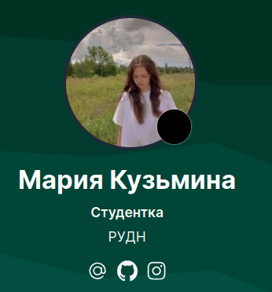
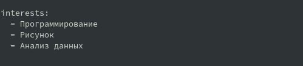
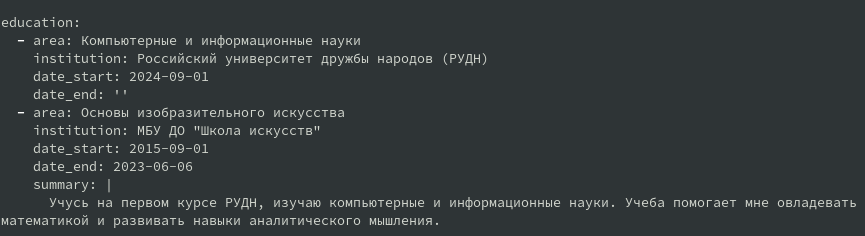

---
## Front matter
title: "Отчёт по индивидуальному проекту №2"
subtitle: "Дисциплина: Операционные системы"
author: "Кузьмина Мария Константиновна"

## Generic otions
lang: ru-RU
toc-title: "Содержание"

## Bibliography
bibliography: bib/cite.bib

## Pdf output format
toc: true # Table of contents
toc-depth: 2
lof: true # List of figures
fontsize: 12pt
linestretch: 1.5
papersize: a4
documentclass: scrreprt
## I18n polyglossia
polyglossia-lang:
  name: russian
  options:
	- spelling=modern
	- babelshorthands=true
polyglossia-otherlangs:
  name: english
## I18n babel
babel-lang: russian
babel-otherlangs: english
## Fonts
mainfont: IBM Plex Serif
romanfont: IBM Plex Serif
sansfont: IBM Plex Sans
monofont: IBM Plex Mono
mathfont: STIX Two Math
mainfontoptions: Ligatures=Common,Ligatures=TeX,Scale=0.94
romanfontoptions: Ligatures=Common,Ligatures=TeX,Scale=0.94
sansfontoptions: Ligatures=Common,Ligatures=TeX,Scale=MatchLowercase,Scale=0.94
monofontoptions: Scale=MatchLowercase,Scale=0.94,FakeStretch=0.9
mathfontoptions:
## Biblatex
biblatex: true
biblio-style: "gost-numeric"
biblatexoptions:
  - parentracker=true
  - backend=biber
  - hyperref=auto
  - language=auto
  - autolang=other*
  - citestyle=gost-numeric
## Pandoc-crossref LaTeX customization
figureTitle: "Рис."
listingTitle: "Листинг"
lofTitle: "Список иллюстраций"
lolTitle: "Листинги"
## Misc options
indent: true
header-includes:
  - \usepackage{indentfirst}
  - \usepackage{float} # keep figures where there are in the text
  - \floatplacement{figure}{H} # keep figures where there are in the text
---

# Цель работы

Добавить к сайту данные о себе

# Задание

1. Разместить фотографию владельца сайта.
2. Разместить краткое описание владельца сайта (Biography).
3. Добавить информацию об интересах (Interests).
4. Добавить информацию от образовании (Education).
5. Сделать пост по прошедшей неделе.
6. Добавить пост на тему: "управление версиями.Git" .

# Выполнение работы

## Разместить фотографию владельца сайта.

Размещаем фотографию владельца сайта, меняя исходное изображение на свое (рис. [-@fig:001])

{#fig:001 width=55%}

## Разместить краткое описание владельца сайта (Biography).

Размещаем краткое описание владельца сайта (рис. [-@fig:002]):

{#fig:002 width=90%}

## Добавить информацию об интересах (Interests).

Добавляем свои интересы (рис. [-@fig:003]):

{#fig:003 width=80%}

## Добавить информацию от образовании (Education).

Добавляем информацию об образовании (рис. [-@fig:004]):

{#fig:004 width=90%}

## Сделать пост по прошедшей неделе.

Пишем пост о том, как провели прошедшую неделю (рис. [-@fig:005]):

{#fig:005 width=70%}

## Добавить пост на тему: "управление версиями.Git" .

Добавляем пост на тему "Управление версиями с помощью Git" (рис. [-@fig:006]):

{#fig:006 width=70%}

 
