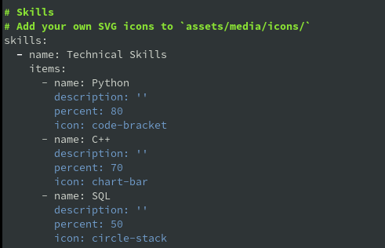
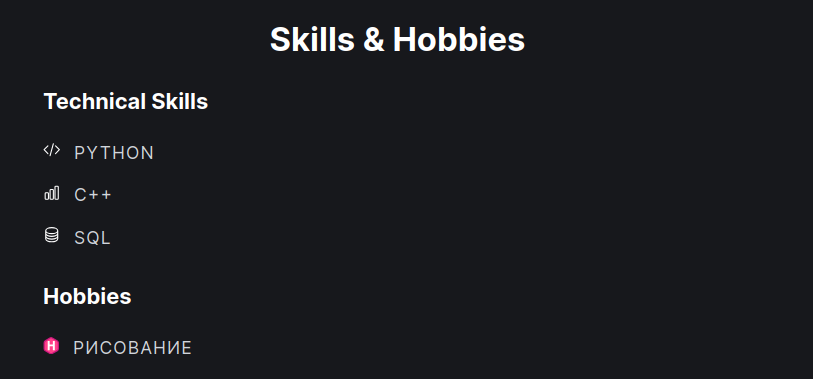
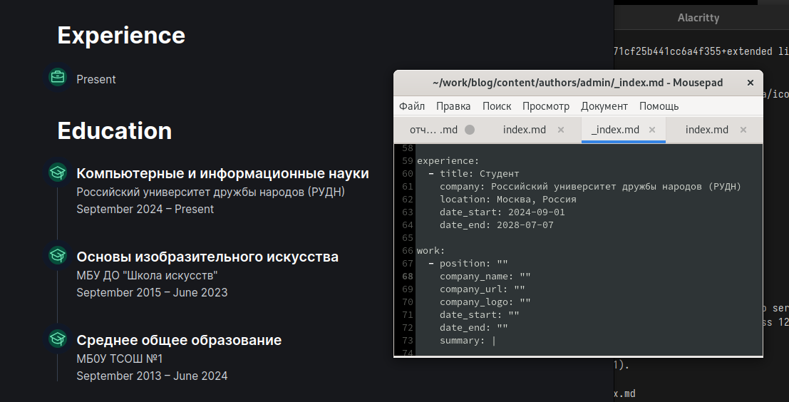
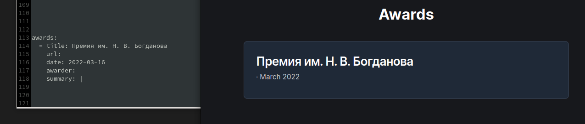
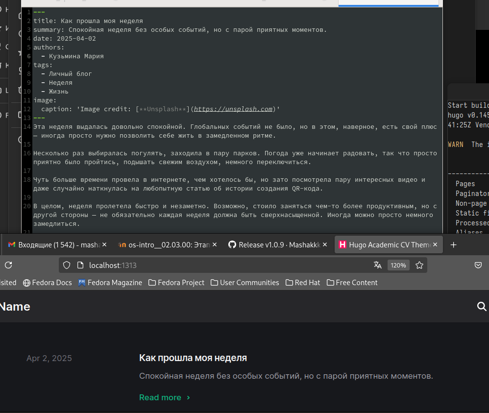
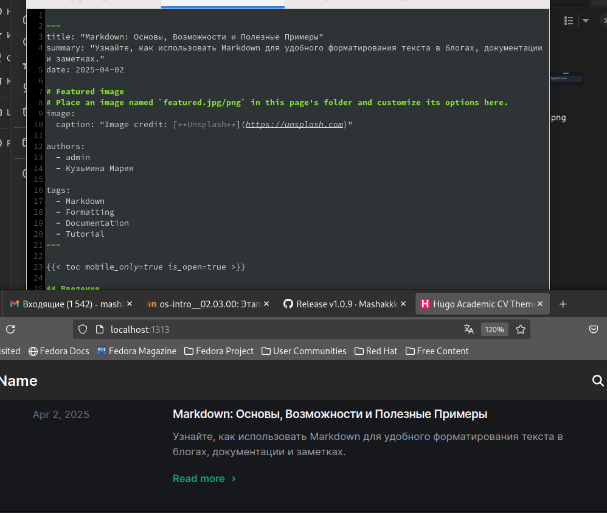

---
## Front matter
lang: ru-RU
title: Индивидуальный проект, шаг №3
subtitle: Операционные системы
author:
  - Кузьмина М. К.
institute:
  - Российский университет дружбы народов, Москва, Россия
date: 2025

## i18n babel
babel-lang: russian
babel-otherlangs: english

## Formatting pdf
toc: false
toc-title: Содержание
slide_level: 2
aspectratio: 169
section-titles: true
theme: metropolis
header-includes:
 - \metroset{progressbar=frametitle,sectionpage=progressbar,numbering=fraction}
 - '\makeatletter'
 - '\beamer@ignorenonframefalse'
 - '\makeatother'
---

# Цель работы

Добавить к сайту достижения

# Задание

1. Добавить информацию о навыках (Skills).
2. Добавить информацию об опыте (Experience).
3. Добавить информацию о достижениях (Accomplishments).
4. Сделать пост по прошедшей неделе.
5. Добавить пост на тему: "Язык разметки Markdown".

# Выполнение работы

## Добавить информацию о навыках (Skills).

Добавляю информацию о навыках (рис.1,2)

{#fig:001 width=39%}

{#fig:002 width=55%}

## Добавить информацию об опыте (Experience).

Добавляю информацию об опыте (рис.3):

{#fig:003 width=70%}

## Добавить информацию о достижениях (Accomplishments).

Добавляю информацию о достижениях (рис.4):

{#fig:004 width=80%}

## Сделать пост по прошедшей неделе.

Пишу пост о том, как провела прошедшую неделю (рис.5):

{#fig:005 width=50%}

## Добавить пост на тему: "Язык разметки Markdown" .

Добавляю пост на тему "Управление версиями с помощью Git" (рис.6):

{#fig:006 width=50%}
